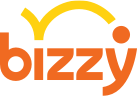
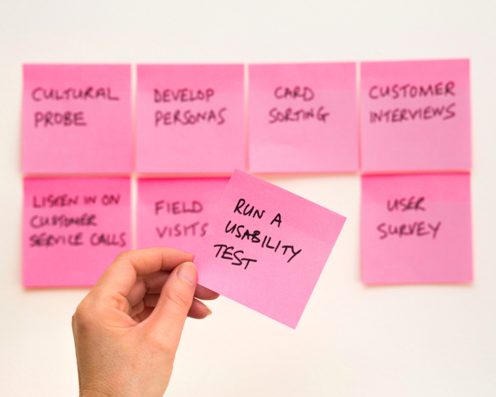
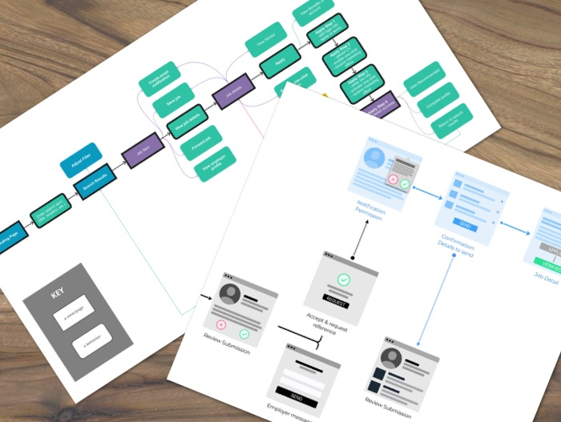
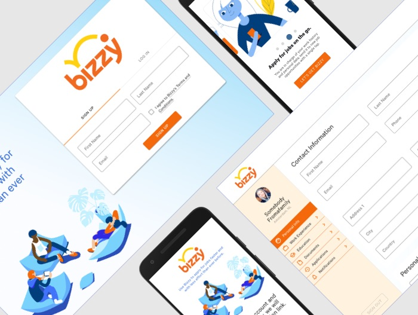
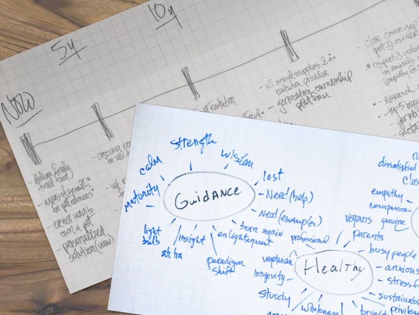
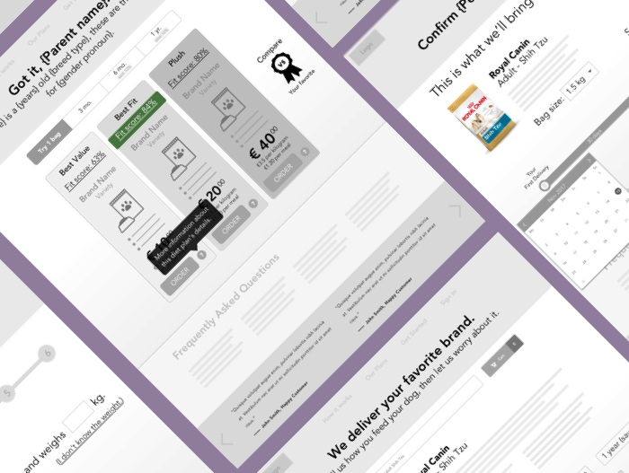

<!-- Main -->

<!-- One -->
<section id="one">
	

		<header class="major">
			<h2>Making the Blockchain accessible for BizzyLabs</h2>
		</header>
		

			
		During the recent past, "Blockchain technology" is a term that's been floating around in a lot of people's conversations. At <a href="https://getbizzy.com">BizzyLabs</a>, we've been doing our best to leverage blockchain as more than just a buzzword, instead we are rolling out a platform that will establish a standard for communicating and maintaining career histories. As the UX Designer on this project, I identified a number of challenges:

		<ul>
			<li>Research the roles and features of competitors like Indeed, LinkedIn, and Glassdoor.</li>
			<li>Understand the current experience of job seekers that share and maintain career histories.</li>
			<li>Improve and innovate on the current experience of job seekers that share and maintain career histories.</li>
			<li>Devise flows and user interfaces that utilize the power of blockchain technology without surfacing its complexity.</li>
		</ul>
	

</section>

<!-- Two -->
<section id="two" class="spotlights">
	<section>
		<a class="image">
			
			Photo of UX post-its by David Travis (Unsplash)
		</a>
		

			

				<header class="major">
					<h3>Research</h3>
				</header>
				
Everyone on the team had been a job seeker; we all had subjective ideas about the best way to design this app. To avoid biased problem solving, a genuine research effort was required. I completed an <b>in-depth analysis of 15 direct and indirect competitors</b>using a spreadsheet to catalog and compare key features and brand aspects. Along with <b>job-seeker interviews conducted along with the Product Manager</b>, I was able to identify missed opportunities our app could address.

			

		

	</section>
	<section>
		<a class="image">
			
			A couple of renderings of my process artifacts
		</a>
		

			

				<header class="major">
					<h3>Flows and Diagrams</h3>
				</header>
				
After gathering a sense of what steps the job seeker goes through while maintaining their career histories, the next step was to chart and diagram those journeys to be able to investigate the kinds of interactions that we could optimize or innovate upon. Mapping out the <b>task flows of competitive apps</b> and building prospective <b>user journeys that our customers would experience</b> were key steps to getting firm design directions.

			

		

	</section>
	<section>
		<a class="image">
			
			A few of my screen designs for BizzyLabs
		</a>
		

			

				<header class="major">
					<h3>Screen Designs</h3>
				</header>
				
Trends, patterns, and behavioral tendencies made clear through research informed my design decisions in the screen design phase. To produce designs quickly and take advantage of an extensive library of base elements, I've used Google's Material Design as a starting point. The true test of these designs' effectiveness will come when this product is put in front of a sufficient number of users. The app launch is imminent and I look forward to continuously learning and improving the way it works.

			

		

	</section>
</section>

<!-- One -->
<section id="one">
	

		<header class="major">
			<h2>Connecting Pets and Owners through Milo</h2>
		</header>
		

			
		Amsterdam is a city with a healthy - if nascent - start up scene. Recently I teamed up with a small outfit aiming to make an impact on the local pet care and nutrition landscape with with a pet nutrition plan and delivery service called Milo. Though I don't have any pets at the moment (7-year-olds don't count, right??) the market potential was immediately clear to me. Perhaps most exciting was the design challenge that included a website/app, a delivery service, and the physical product that would be put in customers' hands. It didn't take long, however, to realize that I would first have to address some foundational design challenges:

		<ul>
			<li>Lead the team in establishing the brand identity and values.</li>
			<li>Hone the vision of the multi-dimensional product offering itself.</li>
		</ul>
	

</section>
<!-- Two -->
<section id="two" class="spotlights">
	<section>
		<a class="image">
			
			A couple of brand workshop artifacts
		</a>
		

			

				<header class="major">
					<h3>Brand Identity and Vision</h3>
				</header>
				
In order to plumb the depths of the ideas and intuition of the founder and other team members, I conducted a custom remix of a Design Sprint and Discovery Workshop delivered over the course of two days. The goal was to establish a clear, internalized understanding of what the company was all about (now and into the future) and where it fits into the overall pet care and nutrition landscape. Through ideation exercises like crazy-8's, word-banking, and brand targeting/spectra, along with a thorough competitive analysis across various dimensions, I lead the team to a foundational brand identity upon which we could develop actual product.

			

		

	</section>
	<section>
		<a class="image">
			
			A few of my wireframes for Milo's app
		</a>
		

			

				<header class="major">
					<h3>Wireframes and Prototypes</h3>
				</header>
				
With a firm grasp on brand, values, and market opportunities, I fine tuned the product offering through a continuous cycle of feedback and iteration on customer journey maps across all the touch points, wireframes, and clickable prototypes. One of the product's main goals was to establish a long-term, trusting, and genuine relationship between the customer and the brand since the focus (the owner's pet) is a loved and sensitive aspect of their life. My designs leveraged transparency, clarity, and a personable tone-of-voice in order to deliver on those objectives.
 
			

		

	</section>
</section>

